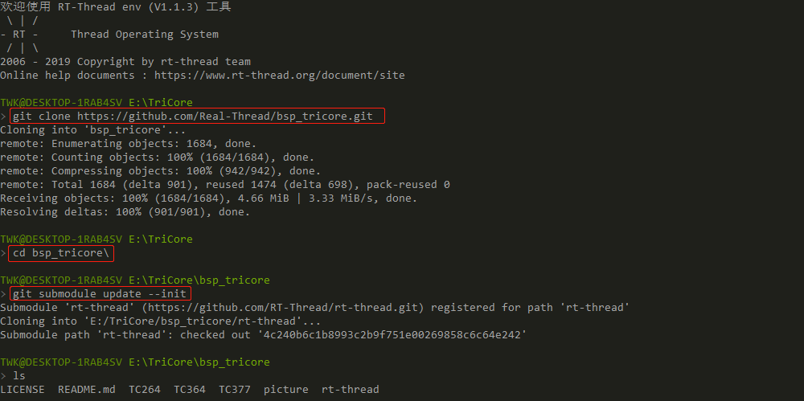
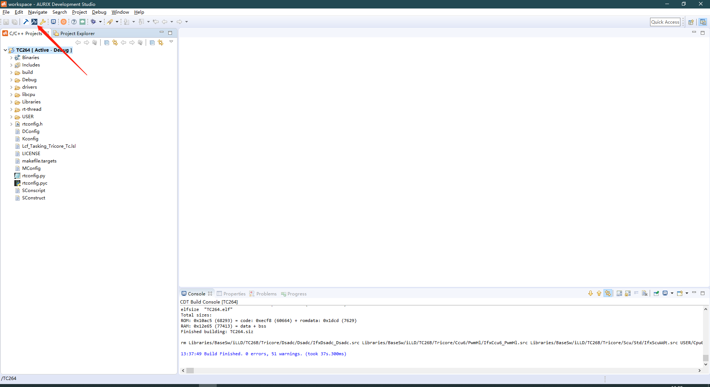
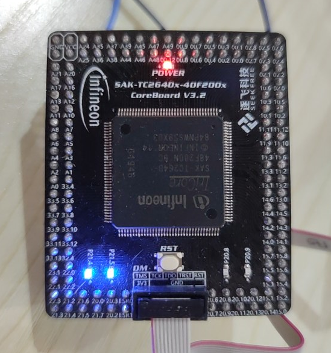

# 英飞凌 TriCore 处理器板级支持包

--- 上海睿赛德电子科技有限公司 版权所有

## 1. 简介

​	TriCore 是**英飞凌** (infineon) 公司专为嵌入式实时系统设计的 32 位精简指令（RISC）的芯片架构。汽车电子上用的比较多。低中断延迟；硬件自动上下文切换 都是它的特点。

| 硬件     | 描述              |
| -------- | ----------------- |
| 芯片型号 | TC264/TC364/TC377 |
| CPU 架构 | TriCore 1.6       |

## 2. 下载源码

1. 在 env 命令行窗口输入如下命令下载官方 BSP 源码：

`git clone https://github.com/Real-Thread/bsp_tricore.git`

2. 进入源码目录更新子仓库:

` cd bsp_tricore\`

`git submodule update --init`

**整个下载源码的流程如下图所示：**



## 3. 创建工程并编译

以 TC264 为例：

1. 使用 env 工具进入 TC264 BSP 目录，输入如下命令：

```
scons --dist 
```


2. 打开 AURIX-Studio IDE ，如下图所示点击 import 按钮导入工程。


3. 找到对应的文件夹工程目录。如下图所示：


4. 右键工程目录，点击 Set Active Project 按钮激活工程。


5. 点击全部编译按钮进行编译。（第一次编译必须选择全部编译！！！）如下图所示：



## 4. 烧写及执行

1. 点击下载按钮。如下图所示：


### 4.1 运行结果

如果编译 & 烧写无误，当复位设备后，会看到板子闪灯：



## 5. 许可协议

这是一份使用 GPLv2 及商业授权的双许可方式 BSP 代码，可以遵守 GPLv2.0 方式把这份代码链接
后的程序源代码都开源的方式来使用，也可以联系睿赛德科技获得商业许可授权。睿赛德联系方式：

邮件地址：business@rt-thread.com

## 6. 注意事项！

 1. 当前工程源码组织形式使用的 scons，添加新的源码参考 scons 使用文档： https://www.rt-thread.org/document/site/#/development-tools/scons/scons

在 scons 中添加了新的源码之后，需要在工程目录下，使用命令 `scons --target=eclipse` 更新工程。然后在工程配置里重新勾选上自动生成 makefiles 文件选项，才可以重新编译。

2. 如果使用 1.3 与 1.4 版本的 ADS，导入工程时需要选择 *将工程文件拷贝入工作区*