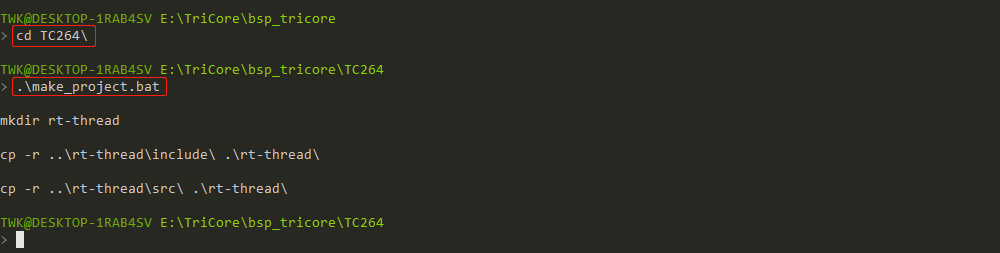
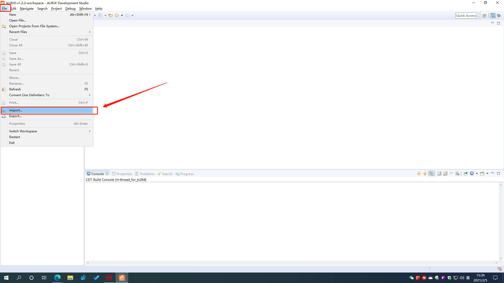
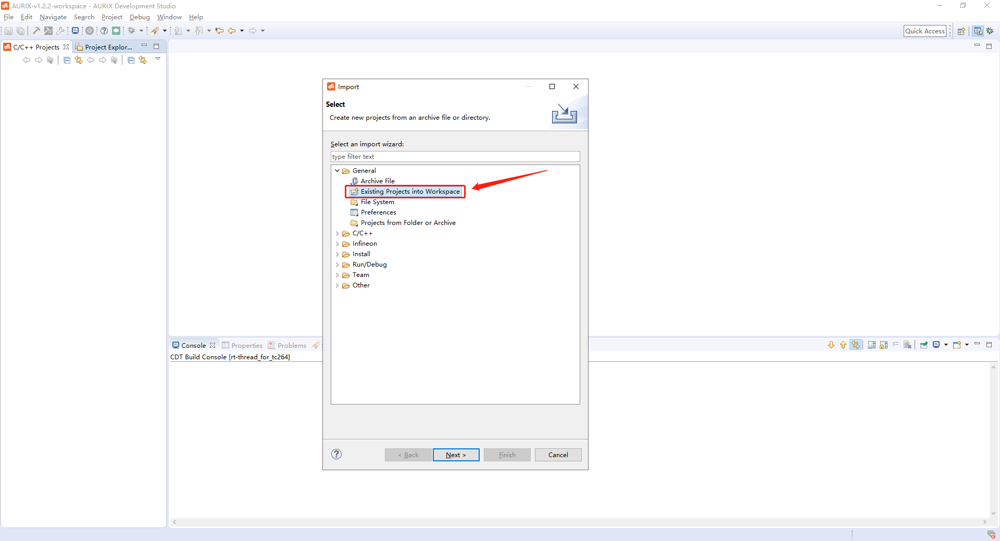
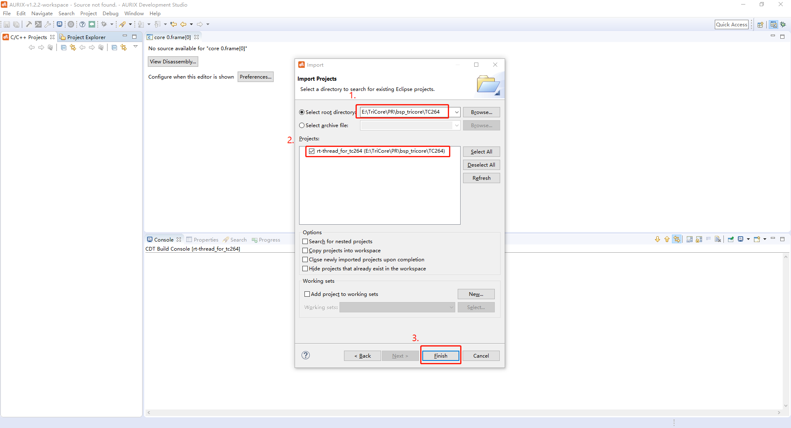
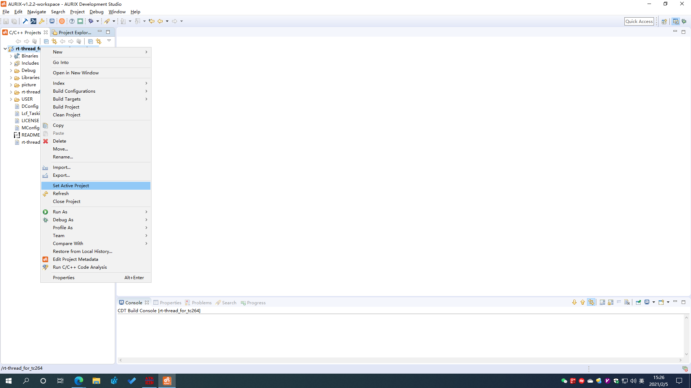
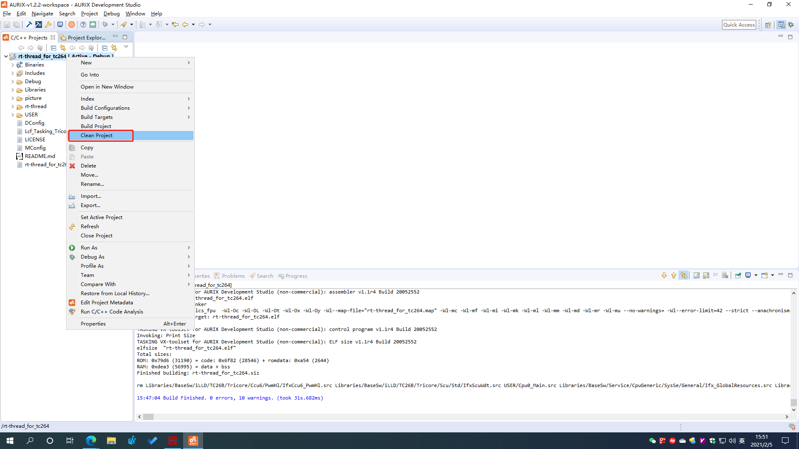
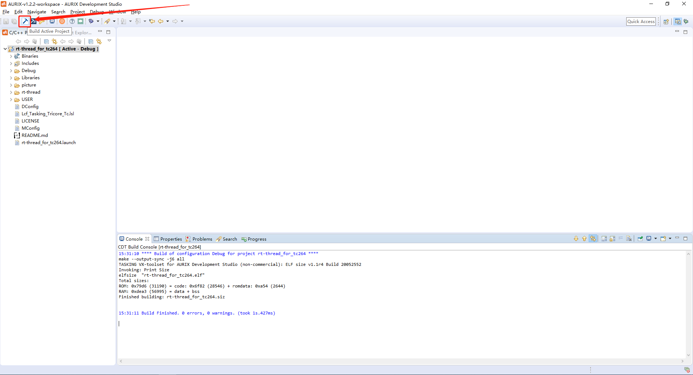
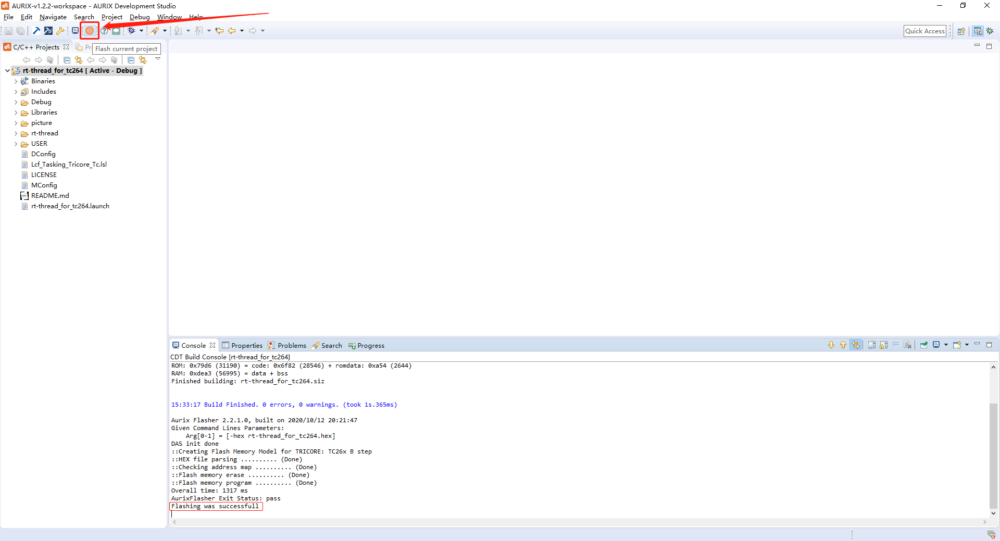
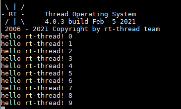

# 英飞凌 TriCore 处理器板级支持包

--- 上海睿赛德电子科技有限公司 版权所有

## 1. 简介

​	TriCore 是**英飞凌** (infineon) 公司专为嵌入式实时系统设计的 32 位精简指令（RISC）的芯片架构。汽车电子上用的比较多。低中断延迟；硬件自动上下文切换 都是它的特点。

| 硬件     | 描述        |
| -------- | ----------- |
| 芯片型号 | TC264       |
| CPU 架构 | TriCore 1.6 |
| 主频     | 200 MHz     |

## 2. 下载并创建工程

1.  输入 `git clone https://github.com/Real-Thread/bsp_tricore.git` 命令，下载源码工程。
2.  输入 `cd bsp_tricore\` 进入工程目录。
3.  输入 `make_project.bat` 生成工程。

详细步骤如下图所示：

## 3. 编译说明

1. 打开 AURIX-Studio IDE ，如下图所示点击 import 按钮导入工程。

2. 找到对应的文件夹工程目录。如下图所示：

3. 右键工程目录，点击 Set Active Project 按钮激活工程。

4. 首次编译前需要清理一遍工程。如下图所示：

5. 点击编译按钮进行编译。如下图所示：

## 4. 烧写及执行

点击下载按钮。如下图所示：

### 4.1 运行结果

如果编译 & 烧写无误，当复位设备后，会在串口上看到RT-Thread的启动logo信息：

## 5. 许可协议

这是一份使用 GPLv2 及商业授权的双许可方式 BSP 代码，可以遵守 GPLv2.0 方式把这份代码链接
后的程序源代码都开源的方式来使用，也可以联系睿赛德科技获得商业许可授权。睿赛德联系方式：

邮件地址：business@rt-thread.com
